Howdy, welcome to my Web Development Adventure 
In this repository, I will be committing my progress as I learn all about Web Development and let us see how I progress!

In order to view the sites visit: https://hevody.github.io/WebDevelopmentAdventure/

had to watch <a href="https://www.youtube.com/watch?v=S2Aj85DEUWs">this video</a> to deploy the website using github pages&nbsp;&nbsp;&nbsp;

  

TODO:
- [ ] make a documentation website; I will be using [this video](https://www.youtube.com/watch?v=xKOhIJQi84w) as a source
- [ ] make a python script that will crawl in the webpages through os.listdir()

# Changelogs

08-11-2026

[./index.html](./index.html)
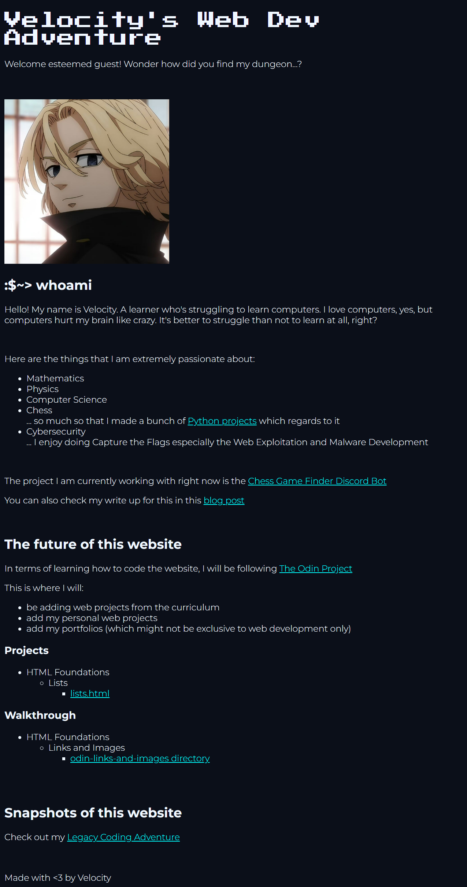
 
[./top-projects/lists.html](./top-projects/lists.html)

 
[./top-walkthrough/odin-links-and-images/index.html](./top-walkthrough/odin-links-and-images/index.html)
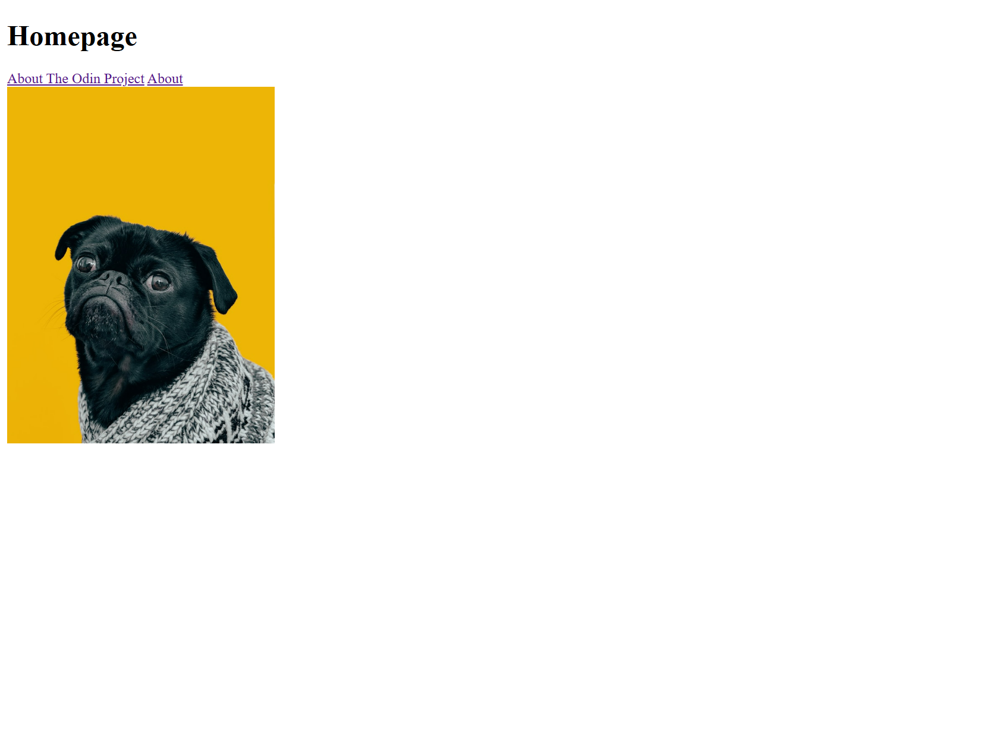
 
[./top-walkthrough/odin-links-and-images/pages/about.html](./top-walkthrough/odin-links-and-images/pages/about.html)
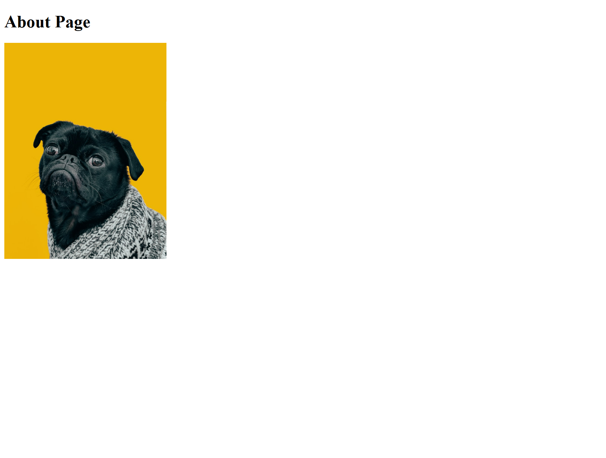
 
[./legacy/index.html](./legacy/index.html)
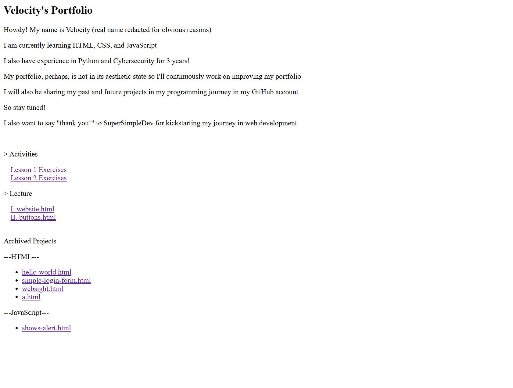
 
[./legacy/Lesson1Exercises.html](./legacy/Lesson1Exercises.html)
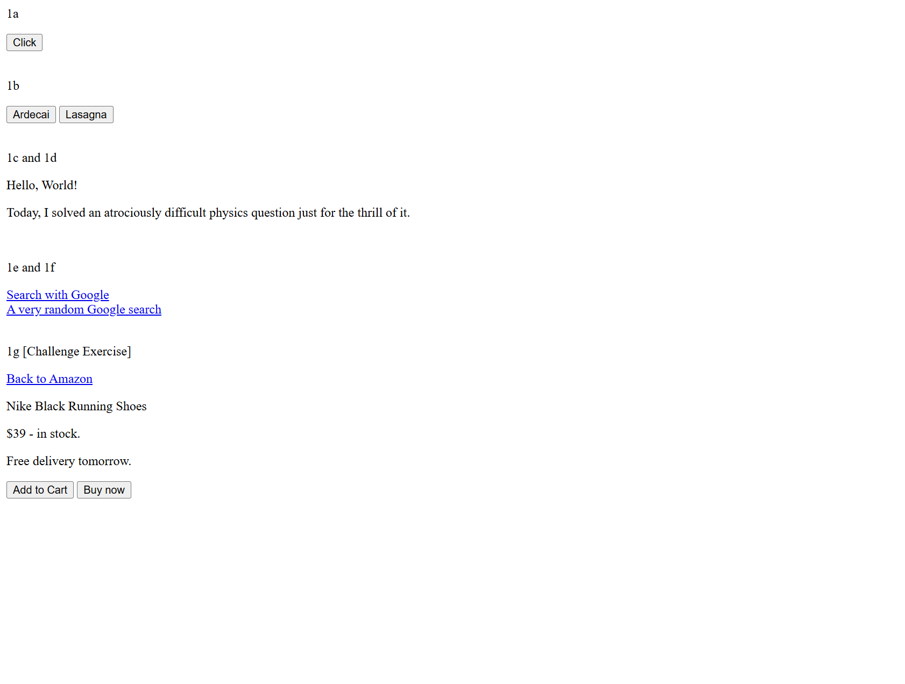
 
[./legacy/Lesson2Exercises.html](./legacy/Lesson2Exercises.html)
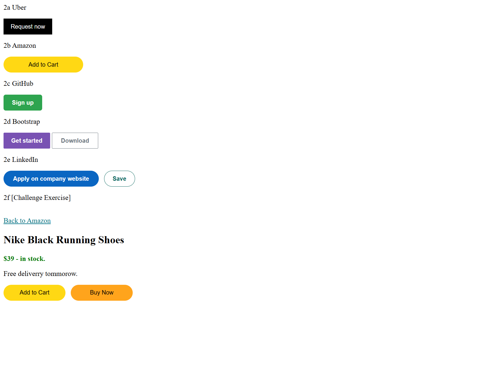
 
[./legacy/website.html](./legacy/website.html)
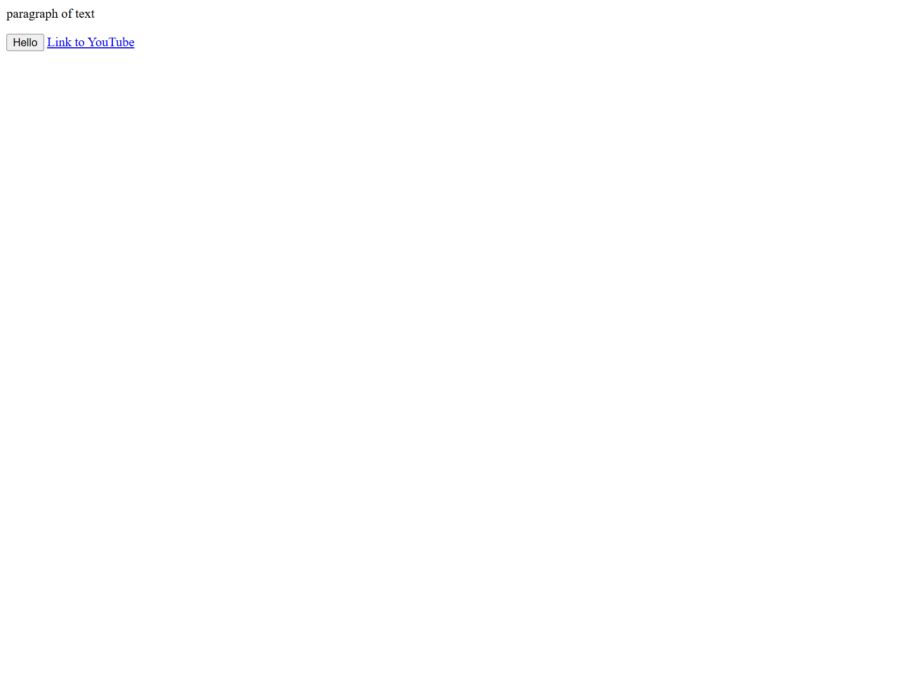
 
[./legacy/buttons.html](./legacy/buttons.html)

 
[./legacy/hello-world.html](./legacy/hello-world.html)
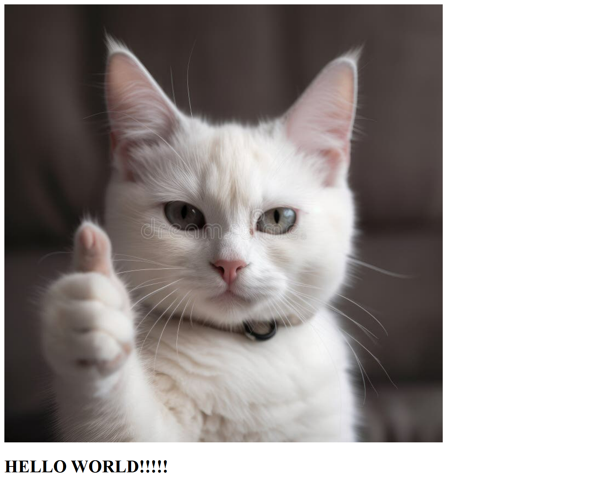
 
[./legacy/simple-login-form.html](./legacy/simple-login-form.html)
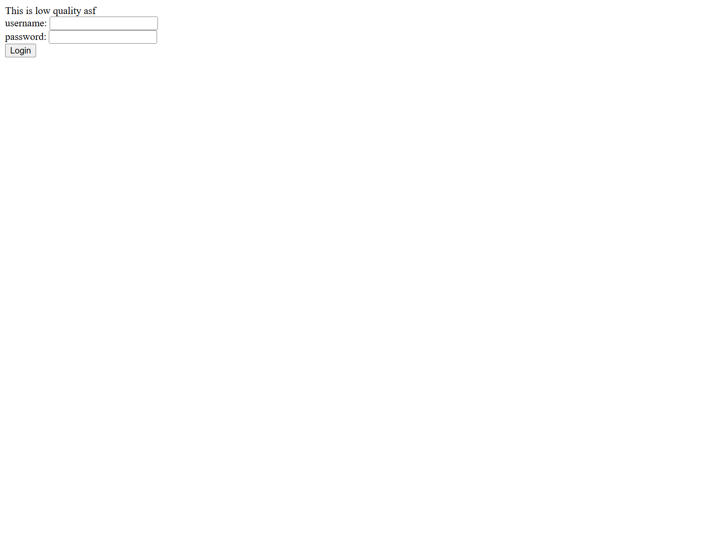
 
[./legacy/websight.html](./legacy/websight.html)
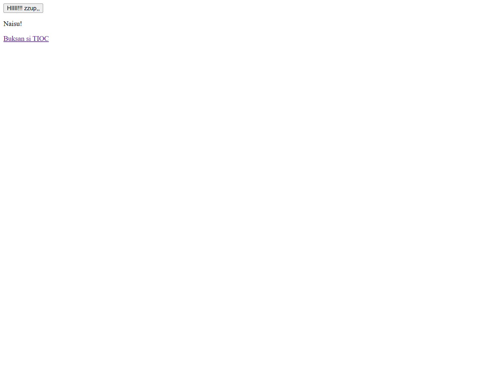
 
[./legacy/a.html](./legacy/a.html)
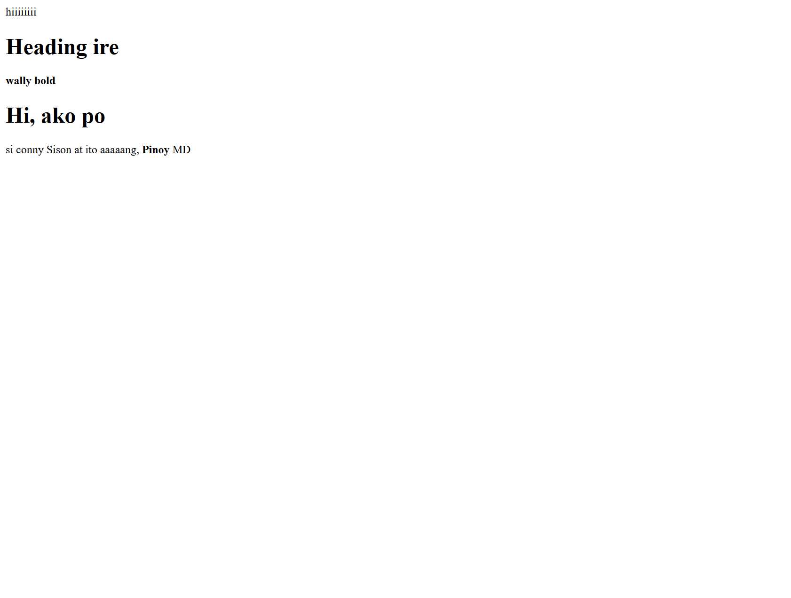
 
[./legacy/shows-alert.html](./legacy/shows-alert.html)
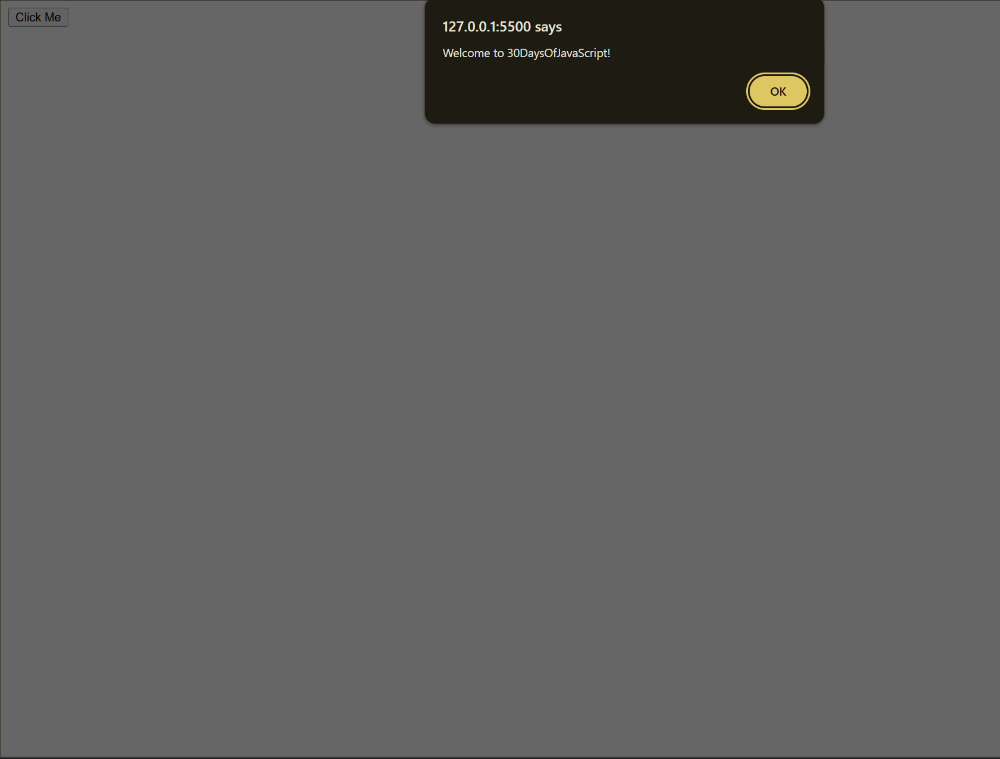

